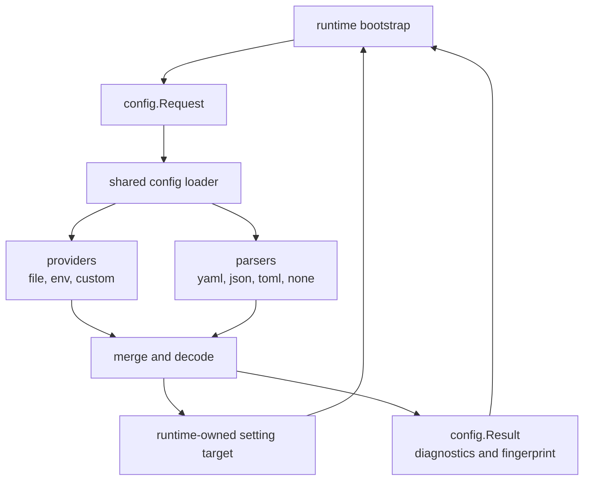

<!--
  dox
  Copyright (C) 2026  OpenDox

  This program is free software: you can redistribute it and/or modify
  it under the terms of the GNU General Public License as published by
  the Free Software Foundation, either version 3 of the License, or
  (at your option) any later version.

  This program is distributed in the hope that it will be useful,
  but WITHOUT ANY WARRANTY; without even the implied warranty of
  MERCHANTABILITY or FITNESS FOR A PARTICULAR PURPOSE. See the
  GNU General Public License for more details.

  You should have received a copy of the GNU General Public License
  along with this program. If not, see <http://www.gnu.org/licenses/>.

  @File    : docs/en-us/handbook/shared-packages/config/README.md
  @Author  : Frost Leo <frostleo.dev@gmail.com>
  @Created : 2026-04-27
  @Modified: 2026-04-27
-->

# Shared Config Package Manual

`packages/shared/config` is the shared Dox configuration loading SDK. It gives each backend runtime an explicit way to read declared sources, parse source payloads, merge values, decode into caller-owned targets, and return operational diagnostics.

This manual defines the package-level config loading contract for runtime packages and system engineering manuals.

> [!IMPORTANT]
> Runtime packages may reference this package, but runtime bootstrap still owns source list selection, default path discovery, secret resolution, redaction policy, hot reload lifecycle, and domain-specific setting validation.

## Manual Pages

| Page | Package Question |
| --- | --- |
| [Contract](contract.md) | Which request, source, option, result, diagnostic, and error semantics are stable for consumers. |
| [Pipeline](pipeline.md) | How values move through provider, parser, merge, decode, fingerprint, and diagnostics stages. |
| [Functions and API](functions.md) | Which exported entry points, interfaces, helpers, and caller obligations are available. |

## Package Position



The package owns the loading pipeline contract. It validates API usage before work starts, executes the pipeline for one explicit `Request`, and returns a `Result` that callers can log or inspect.

## Current Capability Matrix

| Area | Current Status |
| --- | --- |
| Local file provider | Implemented for required and optional file sources. |
| Environment provider | Implemented with prefix filtering and dotted-key expansion. |
| YAML parser | Implemented for object-rooted YAML payloads. |
| JSON parser | Implemented for object-rooted JSON payloads with preserved JSON numbers. |
| TOML parser | Implemented for object-rooted TOML payloads. |
| `none` parser | Implemented for structured provider values, mainly env sources. |
| Merge strategy | Implemented as deep map merge with scalar and slice replacement. |
| Source ordering | Implemented by ascending `Priority`; duplicate priorities are rejected. |
| Decode | Implemented for struct and map pointers through `mapstructure`. |
| Unknown key policy | Implemented with reject-by-default behavior. |
| Result fingerprint | Implemented as stable `sha256:` over merged structured values. |
| Diagnostics | Implemented for source participation and override records. |
| Custom pipeline components | Implemented through custom providers, parsers, mergers, and decoders. |
| Remote provider reads | Not implemented by the default loader; `ProviderKindRemote` is only a named kind. |
| File watching and hot reload | Not implemented by this package. |
| Default path discovery | Not implemented by this package. |
| Secret loading | Not implemented by this package. |
| Schema generation | Not implemented by this package. |
| Redaction | Configured by `Options.RedactKeys`, but not applied to values, diagnostics, errors, or fingerprints. |

## Default Local Load Shape

```go
var target Setting
result, err := sharedconfig.Load(ctx, sharedconfig.Request{
	Runtime: "server",
	Env:     "dev",
	Target:  &target,
	Sources: []sharedconfig.Source{
		{
			Name:     "base",
			Kind:     sharedconfig.ProviderKindFile,
			Parser:   sharedconfig.ParserKindYAML,
			Location: "config/server.yaml",
			Required: true,
			Priority: 10,
		},
		{
			Name:     "env",
			Kind:     sharedconfig.ProviderKindEnv,
			Parser:   sharedconfig.ParserKindNone,
			Location: "DOX_SERVER_",
			Required: false,
			Priority: 100,
		},
	},
	Options: sharedconfig.Options{
		UnknownKeyPolicy: sharedconfig.UnknownKeyPolicyReject,
	},
})
```

This shape reads a required YAML file first, then applies matching environment variables as higher-priority overrides. The caller still owns the `Setting` type, defaults, domain validation, and runtime startup behavior.

> [!WARNING]
> `Options.RedactKeys` is accepted as part of the option shape, but the current pipeline does not apply redaction. Do not treat returned values, diagnostics, errors, or fingerprints as sanitized output.

## System Manual References

System engineering manuals should reference this package manual for:

- source list selection;
- bootstrap-derived values;
- runtime-specific defaults and validation;
- secret and redaction policy;
- hot reload or remote configuration lifecycle;
- startup logging and operational reporting.

Web, Scheduling, Collection, and Computation manuals should document their own concrete source lists, path defaults, secret stores, reload behavior, and validation rules separately.

## Related Package Manuals

- [Shared setting package](../setting/README.md)
- [Shared logging package](../logging/README.md)
- Package source: `packages/shared/config`
- Current server consumer: `server/internal/bootstrap/config`
