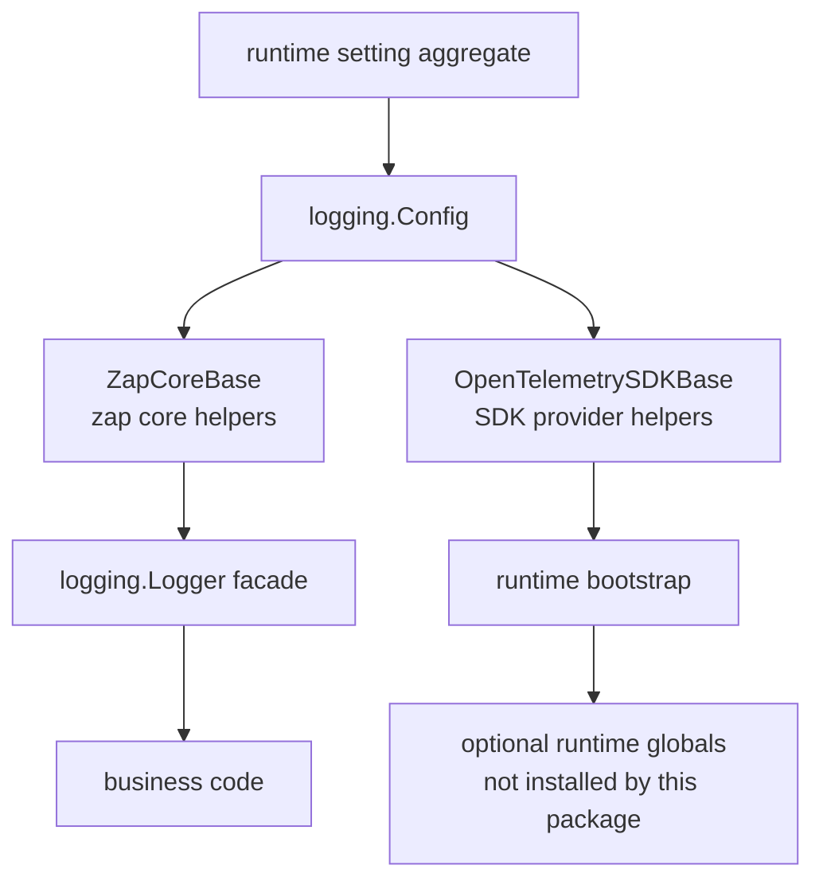

<!--
  dox
  Copyright (C) 2026  OpenDox

  This program is free software: you can redistribute it and/or modify
  it under the terms of the GNU General Public License as published by
  the Free Software Foundation, either version 3 of the License, or
  (at your option) any later version.

  This program is distributed in the hope that it will be useful,
  but WITHOUT ANY WARRANTY; without even the implied warranty of
  MERCHANTABILITY or FITNESS FOR A PARTICULAR PURPOSE. See the
  GNU General Public License for more details.

  You should have received a copy of the GNU General Public License
  along with this program. If not, see <http://www.gnu.org/licenses/>.

  @File    : docs/en-us/handbook/shared-packages/logging/README.md
  @Author  : Frost Leo <frostleo.dev@gmail.com>
  @Created : 2026-04-27
  @Modified: 2026-04-27
-->

# Shared Logging Package Manual

`packages/shared/logging` defines the shared Dox logging model, configuration contract, logger facade, zap core helpers, and OpenTelemetry SDK helpers.

This manual defines the package-level logging contract for runtime packages and system engineering manuals.

> [!IMPORTANT]
> Runtime packages may reference this package, but runtime bootstrap still owns logger construction, OpenTelemetry global installation, HTTP middleware wiring, scheduler/collector/compute integration, and deployment-specific output policy.

## Manual Pages

| Page | Package Question |
| --- | --- |
| [Contract](contract.md) | What the package guarantees, what it does not implement, and how config validation/error semantics work. |
| [Model](model.md) | How resource, correlation, event, node, tags, and fields should be shaped in log records. |
| [Runtime Boundary](runtime-boundary.md) | What the zap core base and OpenTelemetry SDK base build, and which runtime responsibilities remain outside the package. |
| [Functions and API](functions.md) | Which exported types, constructors, helpers, and constants are available to callers. |

## Package Position



Business code should depend on `logging.Logger` and `logging.Attr`. Runtime bootstrap code may use `ZapCoreBase` and `OpenTelemetrySDKBase`.

## Current Capability Matrix

| Area | Current Status |
| --- | --- |
| Config shape | Implemented with defaults, JSON/YAML/mapstructure tags, and validation. |
| Logger facade | Implemented with Dox-owned `Logger` and `Attr` APIs that hide zap types from business-facing signatures. |
| Context correlation | Implemented with context storage, overlay merge, and log-call merge behavior. |
| Zap console core | Implemented. |
| Zap JSON file core | Implemented. |
| Lumberjack rotation | Implemented for single-path file cores. |
| OpenTelemetry resource | Implemented and merged over SDK defaults. |
| OpenTelemetry propagator | Implemented for trace context and baggage. |
| OpenTelemetry SDK providers | Implemented for traces, metrics, and logs when enabled. |
| OpenTelemetry global installation | Not implemented by this package. |
| OTLP exporter setup | Not implemented; enabling it is rejected by the SDK base. |
| Dataset routing | Configured and validated, but not applied to core routing yet. |
| Buffering | Configured and validated, but no buffered writer is installed yet. |
| Redaction | Configured and validated, but no field/value redaction is applied yet. |
| Default file path template rendering | Not implemented; the template is currently passed as a literal output path. |

## Default Configuration Shape

The default configuration creates a console core and a JSONL file core:

```yaml
level: info
cores:
  - name: console
    enabled: true
    type: console
    level: info
    encoding: console
    output_paths: ["stdout"]
    datasets: ["*"]
  - name: service-file
    enabled: true
    type: file
    level: info
    encoding: json
    output_paths: ["logs/${service.namespace}-${service.name}.jsonl"]
    datasets: ["*"]
    rotation:
      driver: lumberjack
      enabled: true
      max_size_mb: 100
      max_backups: 10
      max_age_days: 14
      compress: true
      local_time: true
```

> [!WARNING]
> `logs/${service.namespace}-${service.name}.jsonl` is currently a string default, not a rendered template. Runtime bootstrap or a later package change must render it before a dynamic service-specific path exists.

## System Manual References

System engineering manuals should reference this package manual for:

- `logging.Config` defaults and validation rules;
- the log record model for resource/correlation/event fields;
- the zap and OpenTelemetry runtime boundary;
- the explicit unsupported behavior matrix.

Web, Scheduling, Collection, and Computation manuals should document their own bootstrap choices separately, such as output paths, global provider installation, middleware correlation, and deployment collectors.

## Related Package Manuals

- [Shared config package](../config/README.md)
- [Shared setting package](../setting/README.md)
- Package source: `packages/shared/logging`
- Current server consumer: `server/internal/setting`
