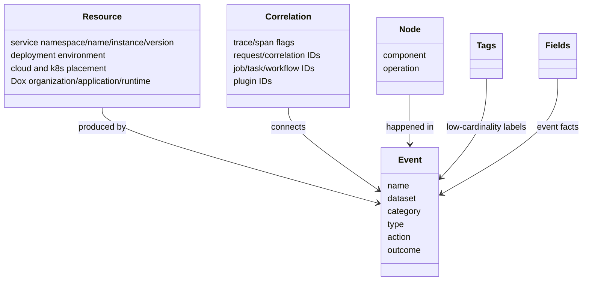

<!--
  dox
  Copyright (C) 2026  OpenDox

  This program is free software: you can redistribute it and/or modify
  it under the terms of the GNU General Public License as published by
  the Free Software Foundation, either version 3 of the License, or
  (at your option) any later version.

  This program is distributed in the hope that it will be useful,
  but WITHOUT ANY WARRANTY; without even the implied warranty of
  MERCHANTABILITY or FITNESS FOR A PARTICULAR PURPOSE. See the
  GNU General Public License for more details.

  You should have received a copy of the GNU General Public License
  along with this program. If not, see <http://www.gnu.org/licenses/>.

  @File    : docs/en-us/handbook/shared-packages/logging/model.md
  @Author  : Frost Leo <frostleo.dev@gmail.com>
  @Created : 2026-04-27
  @Modified: 2026-04-27
-->

# Shared Logging Model

The shared logging model defines how Dox log records describe the producer, execution chain, observed event, internal node, tags, and detailed fields.

## Model Map



## Resource

Resource fields answer who produced telemetry.

| Field Constant | JSON Field | Meaning |
| --- | --- | --- |
| `FieldServiceNamespace` | `service.namespace` | Service namespace, often `dox`. |
| `FieldServiceName` | `service.name` | Service capability name, not necessarily runtime. |
| `FieldServiceInstanceID` | `service.instance.id` | Process, pod, node, or instance identity. |
| `FieldServiceVersion` | `service.version` | Deployed service version. |
| `FieldDeploymentEnvironmentName` | `deployment.environment.name` | Deployment env such as `prod`. |
| `FieldCloudRegion` | `cloud.region` | Cloud region. |
| `FieldCloudAvailabilityZone` | `cloud.availability_zone` | Cloud availability zone. |
| `FieldK8sClusterName` | `k8s.cluster.name` | Kubernetes cluster. |
| `FieldK8sNamespaceName` | `k8s.namespace.name` | Kubernetes namespace. |
| `FieldDoxOrganization` | `dox.organization` | Dox owner organization. |
| `FieldDoxApplication` | `dox.application` | Dox application family. |
| `FieldDoxRuntime` | `dox.runtime` | Dox runtime: `server`, `scheduler`, `collector`, or `compute`. |

> [!TIP]
> `service.name` identifies a service capability. `dox.runtime` identifies the runtime process family. A `server` runtime can host an `iam` service.

## Correlation

Correlation fields connect one request, job, task, workflow, plugin run, or cross-runtime chain.

| Field Constant | JSON Field |
| --- | --- |
| `FieldTraceID` | `trace_id` |
| `FieldSpanID` | `span_id` |
| `FieldTraceFlags` | `trace_flags` |
| `FieldRequestID` | `request_id` |
| `FieldCorrelationID` | `correlation_id` |
| `FieldJobID` | `job_id` |
| `FieldTaskID` | `task_id` |
| `FieldWorkflowID` | `workflow_id` |
| `FieldPluginID` | `plugin_id` |
| `FieldPluginRunID` | `plugin_run_id` |

`trace_id`, `span_id`, and `trace_flags` align with OpenTelemetry. `correlation_id` is Dox-owned and should survive across request, task, event, and plugin boundaries.

## Event

Event fields describe what the log record observes.

| Field Constant | JSON Field | Example |
| --- | --- | --- |
| `FieldEventName` | `event.name` | `iam.login.rejected` |
| `FieldEventDataset` | `event.dataset` | `dox.iam.security` |
| `FieldEventCategory` | `event.category` | `authentication` |
| `FieldEventType` | `event.type` | `denied` |
| `FieldEventAction` | `event.action` | `login` |
| `FieldEventOutcome` | `event.outcome` | `failure` |

There is no first-class `channel` field. Dataset, category, type, action, and outcome carry event classification.

## Node

Node fields describe where inside a service an event happened.

| Field Constant | JSON Field | Meaning |
| --- | --- | --- |
| `FieldComponent` | `component` | Internal component such as `auth_service`. |
| `FieldOperation` | `operation` | Operation such as `verify_credential`. |

## Tags and Fields

`Tags` are low-cardinality business labels declared by the current node. `Fields` are event facts and higher-cardinality details.

| Use `tags` For | Use `fields` For |
| --- | --- |
| `risk_level` | `account` |
| `login_method` | `tenant_id` |
| `credential_type` | `client_ip` |
| `reject_reason` | `failed_attempts` |
| `queue` | raw IDs and measured facts |

Do not put resource fields, correlation IDs, or verbose error text into `tags`.

<details>
<summary>Example: IAM login rejected record</summary>

```json
{
  "service.namespace": "dox",
  "service.name": "iam",
  "dox.runtime": "server",
  "deployment.environment.name": "prod",
  "trace_id": "trace_001",
  "request_id": "req_001",
  "correlation_id": "corr_001",
  "event.name": "iam.login.rejected",
  "event.dataset": "dox.iam.security",
  "event.category": "authentication",
  "event.type": "denied",
  "event.action": "login",
  "event.outcome": "failure",
  "component": "auth_service",
  "operation": "verify_credential",
  "tags": {
    "risk_level": "medium",
    "login_method": "password",
    "reject_reason": "invalid_password"
  },
  "fields": {
    "account": "alice@example.com",
    "tenant_id": "tenant_a",
    "client_ip": "203.0.113.10"
  }
}
```

</details>

## Merge Semantics in Logger Attributes

Attribute constructors merge non-empty structured values:

- `ResourceAttr`, `CorrelationAttr`, `EventAttr`, and `NodeAttr` overlay non-empty fields.
- `TagsAttr` and `FieldsAttr` copy entries with non-empty keys.
- `FieldAttr` adds one entry to `fields`.
- `ErrorAttr` attaches the error field.

Call-site attributes are applied after logger-level attributes and context correlation. Call-site values can override earlier structured values.

## Related Pages

- [Contract](contract.md)
- [Runtime Boundary](runtime-boundary.md)
- [Functions and API](functions.md)
