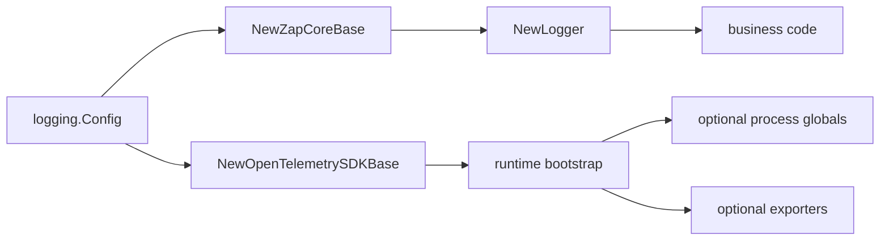

<!--
  dox
  Copyright (C) 2026  OpenDox

  This program is free software: you can redistribute it and/or modify
  it under the terms of the GNU General Public License as published by
  the Free Software Foundation, either version 3 of the License, or
  (at your option) any later version.

  This program is distributed in the hope that it will be useful,
  but WITHOUT ANY WARRANTY; without even the implied warranty of
  MERCHANTABILITY or FITNESS FOR A PARTICULAR PURPOSE. See the
  GNU General Public License for more details.

  You should have received a copy of the GNU General Public License
  along with this program. If not, see <http://www.gnu.org/licenses/>.

  @File    : docs/en-us/handbook/shared-packages/logging/runtime-boundary.md
  @Author  : Frost Leo <frostleo.dev@gmail.com>
  @Created : 2026-04-27
  @Modified: 2026-04-27
-->

# Shared Logging Runtime Boundary

The shared logging runtime boundary defines how `packages/shared/logging` touches zap, lumberjack, and OpenTelemetry SDKs while runtime bootstrap remains runtime-owned.

## Boundary Diagram

The package builds reusable primitives. The runtime decides when and where to install or expose those primitives.

## Zap Core Base

`NewZapCoreBase` currently implements:

- Dox `Level` to `zapcore.Level` mapping;
- zap `AtomicLevel` creation;
- symbolic encoder mapping;
- zap `Config` mapping;
- console core creation;
- JSON file core creation;
- lumberjack rotation for a single output path;
- no-rotation file core through zap output paths;
- zap options for development, caller, stacktrace, error output, and initial fields;
- optional zap sampling;
- `DisableErrorVerbose` behavior that keeps `error` as the basic string and suppresses `errorVerbose`.

`ZapCoreBase.Close` releases opened sinks. Runtime bootstrap must call it during shutdown when it owns a base.

## File Core Boundary

| Rotation Driver | Current Behavior |
| --- | --- |
| `lumberjack` | Supported for file cores with exactly one output path. |
| `none` | Supported through zap file output path behavior. |
| `external` | Valid config value, but rejected by the current zap file sink. |
| `logrotate` | Valid config value, but rejected by the current zap file sink. |

> [!CAUTION]
> Lumberjack assumes only one process writes to the configured file path on the same machine. Deployment policy must avoid multiple Dox processes sharing one rotating file path.

## OpenTelemetry SDK Base

`NewOpenTelemetrySDKBase` currently implements:

- Dox `Resource` to OpenTelemetry resource attributes;
- merge over `sdkresource.Default()`;
- trace context and baggage propagator mapping;
- trace sampler mapping for `always_on`, `always_off`, `traceidratio`, and `parentbased_traceidratio`;
- optional tracer provider construction;
- optional meter provider construction;
- optional logger provider construction;
- force flush and shutdown using `Shutdown.Timeout`.

When root OpenTelemetry is disabled, the base still exposes a resource and a no-op propagator but does not build providers.

## OpenTelemetry Boundary

The SDK base does not call:

- `otel.SetTracerProvider`;
- `otel.SetMeterProvider`;
- `otel.SetTextMapPropagator`;
- any process-global log provider setter.

It also does not create OTLP exporters. If `otel.exporter.otlp.enabled` is true, `NewOpenTelemetrySDKBase` returns a validation error for `otel.exporter.otlp.enabled`.

## Runtime Bootstrap Responsibilities

Runtime bootstrap owns:

- translating runtime setting into `logging.Config` and `logging.Resource`;
- rendering any output path templates;
- choosing file locations and deployment sink policy;
- constructing `ZapCoreBase`;
- constructing the `Logger` facade;
- constructing `OpenTelemetrySDKBase`;
- optionally installing OpenTelemetry globals;
- configuring exporters or collectors;
- injecting correlation into HTTP, task, job, workflow, and plugin contexts;
- calling `Sync`, `ForceFlush`, `Shutdown`, and `Close` at the right lifecycle points.

## Current Gaps That Must Stay Visible

| Gap | Why It Matters |
| --- | --- |
| Redaction is not applied | Sensitive values can still appear unless callers sanitize before logging. |
| Buffering is not installed | `BufferingConfig` does not create a buffered writer yet. |
| Dataset routing is not applied | All enabled cores receive records according to level; `event.dataset` does not select cores yet. |
| Default file path template is not rendered | The default path is literal unless runtime code replaces placeholders. |
| OTLP exporter is unsupported | Runtime/exporter integration must be implemented separately. |
| No runtime bootstrap is included | Server, scheduler, collector, and compute must wire lifecycle behavior themselves. |

## Related Pages

- [Contract](contract.md)
- [Model](model.md)
- [Functions and API](functions.md)
