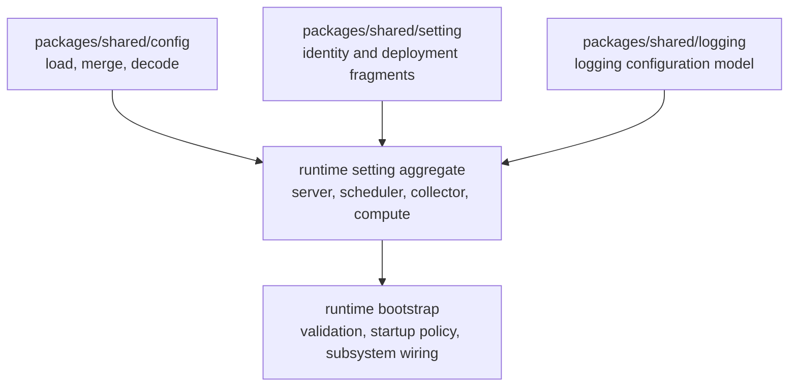

<!--
  dox
  Copyright (C) 2026  OpenDox

  This program is free software: you can redistribute it and/or modify
  it under the terms of the GNU General Public License as published by
  the Free Software Foundation, either version 3 of the License, or
  (at your option) any later version.

  This program is distributed in the hope that it will be useful,
  but WITHOUT ANY WARRANTY; without even the implied warranty of
  MERCHANTABILITY or FITNESS FOR A PARTICULAR PURPOSE. See the
  GNU General Public License for more details.

  You should have received a copy of the GNU General Public License
  along with this program. If not, see <http://www.gnu.org/licenses/>.

  @File    : docs/en-us/handbook/shared-packages/setting/README.md
  @Author  : Frost Leo <frostleo.dev@gmail.com>
  @Created : 2026-04-27
  @Modified: 2026-04-27
-->

# Shared Setting Package Manual

`packages/shared/setting` defines reusable Dox identity and deployment setting fragments. It is intentionally smaller than a runtime setting system: it provides shared fragments, defaults, enum constraints, and validation helpers that each runtime can compose into its own concrete aggregate.

This manual defines the package-level setting fragment contract for runtime packages and system engineering manuals.

> [!IMPORTANT]
> Runtime packages may reference this package, but runtime bootstrap still owns concrete setting aggregates, runtime identity selection, runtime-specific defaults, cross-fragment validation, and subsystem-specific setting groups.

## Manual Pages

| Page | Package Question |
| --- | --- |
| [Contract](contract.md) | Which behavior belongs to the shared package, which behavior belongs to runtime packages, and how validation errors should be interpreted. |
| [Model](model.md) | Which fragments, enums, fields, defaults, and validation tags make up the shared setting model. |
| [Functions and API](functions.md) | Which exported constants, types, methods, helpers, and caller obligations form the package API. |

## Package Position



The shared setting package is consumed by runtime packages, but it does not know which concrete runtime is being built. For example, `server/internal/setting` composes these fragments and then adds server-owned rules such as forcing `System.Runtime` to `server`.

## Current Capability Matrix

| Area | Current Status |
| --- | --- |
| Runtime enum | Implemented for `server`, `scheduler`, `collector`, and `compute`. |
| Environment enum | Implemented for `dev`, `test`, `staging`, and `prod`. |
| Organization fragment | Implemented with default name and stable identifier validation. |
| Application fragment | Implemented with default name and kebab-name validation. |
| System fragment | Implemented with runtime validation, but no default runtime selection. |
| Service fragment | Implemented with namespace/name default helpers and identifier validation. |
| Deployment fragment | Implemented with default env and placement identifier fields. |
| Fragment defaults | Implemented as conservative `Default` methods. |
| Fragment validation | Implemented through Dox-owned validation tags. |
| Validation errors | Implemented with Dox-owned `ValidationError` and `FieldError` types. |
| Root `Setting` aggregate | Not implemented by this package. |
| HTTP/database/security/queue/plugin settings | Not implemented by this package. |
| Config source loading and decoding | Not implemented by this package. |
| Service discovery or deployment manifest modeling | Not implemented by this package. |
| Runtime bootstrap behavior | Not implemented by this package. |
| Server-only validation rules | Not implemented by this package. |

## Default Fragment Shape

```yaml
organization:
  name: opendox
application:
  name: dox
system:
  runtime: ""
service:
  namespace: dox
  name: ""
deployment:
  env: dev
```

`System.Default` intentionally does not choose a runtime. `Service.Default` can fill `service.name` from `system.runtime` only when the runtime value is already known.

> [!WARNING]
> The empty `system.runtime` and `service.name` values above are not valid final runtime settings. Runtime packages must choose their own runtime identity before validation.

## System Manual References

System engineering manuals should reference this package manual for:

- supported `Runtime` and `Env` values;
- shared identity and deployment fragment semantics;
- defaulting and validation contracts;
- `ValidationError` and `FieldError` shape;
- the package boundary between shared fragments and runtime-owned aggregates.

Runtime manuals should document their own aggregate shape, runtime selection, bootstrap-derived seed values, stricter validation rules, and subsystem-specific setting groups separately.

## Related Package Manuals

- [Shared config package](../config/README.md)
- [Shared logging package](../logging/README.md)
- Package source: `packages/shared/setting`
- Current server consumer: `server/internal/setting`
