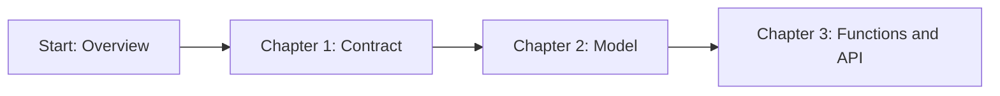
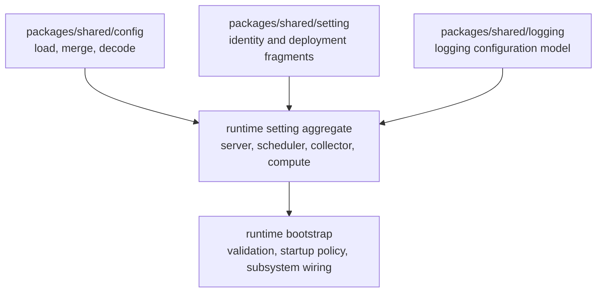

<!--
  dox
  Copyright (C) 2026  OpenDox

  This program is free software: you can redistribute it and/or modify
  it under the terms of the GNU General Public License as published by
  the Free Software Foundation, either version 3 of the License, or
  (at your option) any later version.

  This program is distributed in the hope that it will be useful,
  but WITHOUT ANY WARRANTY; without even the implied warranty of
  MERCHANTABILITY or FITNESS FOR A PARTICULAR PURPOSE. See the
  GNU General Public License for more details.

  You should have received a copy of the GNU General Public License
  along with this program. If not, see <http://www.gnu.org/licenses/>.

  @File    : docs/en-us/handbook/shared-packages/setting/README.md
  @Author  : Frost Leo <frostleo.dev@gmail.com>
  @Created : 2026-04-27
  @Modified: 2026-04-27
-->

# Shared Setting Package Handbook

| Previous | Up | Next |
| --- | --- | --- |
| [Shared config package](../config/README.md) | Shared packages | [Chapter 1: Contract](contract.md) |

> [!NOTE]
> This handbook is written as a short module book. Read it in order when adding a new runtime setting aggregate, and use the chapter links when returning for a specific contract or API detail.

`packages/shared/setting` defines reusable Dox identity and deployment setting fragments. It is intentionally smaller than a runtime setting system: it provides shared fragments, defaults, enum constraints, and validation helpers that each runtime can compose into its own concrete aggregate.

## Reading Path



1. [Chapter 1: Contract](contract.md) defines what the package owns, what it refuses to own, and how validation errors should be interpreted.
2. [Chapter 2: Model](model.md) describes each shared fragment, its fields, defaults, and validation tags.
3. [Chapter 3: Functions and API](functions.md) lists exported types, methods, constants, and caller obligations.

## Book Scope

This handbook is the package-level reference for:

- Dox runtime identity values;
- Dox deployment environment values;
- shared identity fragments such as `Organization`, `Application`, `System`, and `Service`;
- shared deployment fragments such as `Deployment`;
- Dox-owned validation tags and validation error shape;
- the reuse boundary between shared fragments and runtime-owned setting aggregates.

It is meant to be linked from the future Web, Scheduling, Collection, and Computation engineering manuals.

## Package Position

`packages/shared/setting` sits between generic config loading and runtime-specific setting aggregates.



The shared setting package is consumed by runtime packages, but it does not know which concrete runtime is being built. For example, `server/internal/setting` composes these fragments and then adds server-owned rules such as forcing `System.Runtime` to `server`.

## Current Capability

The package currently provides:

- `Runtime` enum values for `server`, `scheduler`, `collector`, and `compute`;
- `Env` enum values for `dev`, `test`, `staging`, and `prod`;
- default organization and application names;
- `Organization`, `Application`, `System`, `Service`, and `Deployment` fragments;
- conservative `Default` methods for fragments;
- Dox-owned validation rules for kebab names, stable identifiers, runtime values, and env values;
- `ValidationError` and `FieldError` types that hide the third-party validator error type from callers.

## Current Non-capability

The package currently does not provide:

- a root `Setting` aggregate;
- HTTP, database, security, queue, logging, or plugin setting groups;
- config file loading, source merging, or decoding;
- service discovery or deployment manifest modeling;
- default runtime selection for all systems;
- server-only validation rules;
- runtime bootstrap behavior.

> [!IMPORTANT]
> Do not move runtime-owned policy into this package because one runtime currently needs it. Shared fragments should stay reusable across Web, Scheduling, Collection, and Computation.

## Consumer Integration Checklist

- [ ] Compose only the fragments whose semantics match the runtime aggregate.
- [ ] Fill shared defaults before runtime-specific defaults when doing so keeps the flow easy to reason about.
- [ ] Keep runtime-owned identity rules in the runtime package.
- [ ] Validate shared fragments with their `Validate` methods or `setting.Validate`.
- [ ] Join shared validation errors with runtime-owned validation errors at the aggregate boundary.
- [ ] Document any runtime-specific default or stricter validation rule outside this shared package handbook.

<details>
<summary>Example: current server composition</summary>

`server/internal/setting.Identity` composes these shared fragments:

```go
type Identity struct {
	Organization sharedsetting.Organization `json:"organization" yaml:"organization" mapstructure:"organization"`
	Application  sharedsetting.Application  `json:"application" yaml:"application" mapstructure:"application"`
	System       sharedsetting.System       `json:"system" yaml:"system" mapstructure:"system"`
	Service      sharedsetting.Service      `json:"service" yaml:"service" mapstructure:"service"`
	Deployment   sharedsetting.Deployment   `json:"deployment" yaml:"deployment" mapstructure:"deployment"`
}
```

The server package then owns the server-specific rule that `System.Runtime` must be `server`. That rule is not part of the shared package contract.

</details>

## Navigation

| Previous | Up | Next |
| --- | --- | --- |
| [Shared config package](../config/README.md) | Shared packages | [Chapter 1: Contract](contract.md) |
