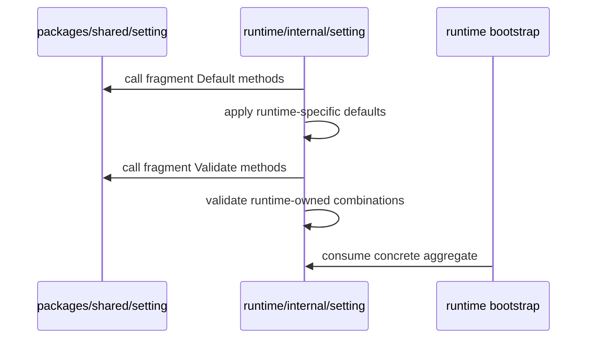

<!--
  dox
  Copyright (C) 2026  OpenDox

  This program is free software: you can redistribute it and/or modify
  it under the terms of the GNU General Public License as published by
  the Free Software Foundation, either version 3 of the License, or
  (at your option) any later version.

  This program is distributed in the hope that it will be useful,
  but WITHOUT ANY WARRANTY; without even the implied warranty of
  MERCHANTABILITY or FITNESS FOR A PARTICULAR PURPOSE. See the
  GNU General Public License for more details.

  You should have received a copy of the GNU General Public License
  along with this program. If not, see <http://www.gnu.org/licenses/>.

  @File    : docs/en-us/handbook/shared-packages/setting/contract.md
  @Author  : Frost Leo <frostleo.dev@gmail.com>
  @Created : 2026-04-27
  @Modified: 2026-04-27
-->

# Chapter 1: Shared Setting Contract

| Previous | Up | Next |
| --- | --- | --- |
| [Overview](README.md) | [Shared setting package](README.md) | [Chapter 2: Model](model.md) |

> [!TIP]
> Read this chapter before composing the package into a runtime aggregate. It defines which decisions belong in the shared package and which decisions must stay in runtime-owned code.

## Contract Summary

`packages/shared/setting` owns reusable identity and deployment fragments. It does not own a concrete runtime setting aggregate.

| Contract Area | Package Responsibility | Caller Responsibility |
| --- | --- | --- |
| Runtime values | Declare supported Dox runtime enum values. | Decide which runtime value a concrete aggregate accepts. |
| Environment values | Declare supported Dox deployment env values. | Decide how env is seeded from bootstrap or deployment inputs. |
| Fragment defaults | Fill conservative shared defaults. | Add runtime-specific defaults after or around shared defaults. |
| Fragment validation | Validate shared field syntax and enum values. | Validate runtime-specific combinations and stricter rules. |
| Error shape | Return Dox-owned validation error types. | Join or translate errors at runtime aggregate boundaries. |

## Identity Contract

The package defines identity fragments, not a global identity aggregate. A runtime may compose these fragments into its own group when their semantics match:

- `Organization` for ownership and governance identity;
- `Application` for the Dox application family;
- `System` for the Dox runtime identity;
- `Service` for one logical service identity;
- `Deployment` for environment and deployment location.

The shared package does not decide that a server must use `RuntimeServer`, that a scheduler must use `RuntimeScheduler`, or that a deployment env came from a specific flag. Runtime packages own those decisions.

## Default Contract

Defaults are intentionally conservative.

| Fragment | Shared Default Behavior |
| --- | --- |
| `Organization` | Empty `Name` becomes `opendox`. |
| `Application` | Empty `Name` becomes `dox`. |
| `System` | No runtime is invented. Runtime identity must be explicit or set by a consumer package. |
| `Service` | Empty `Namespace` becomes `Application.Name`; empty `Name` becomes `string(System.Runtime)` only when runtime is already known. |
| `Deployment` | Empty `Env` becomes `dev`. |

> [!IMPORTANT]
> `System.Default` is a no-op by design. A shared package cannot safely choose between `server`, `scheduler`, `collector`, and `compute`.

## Validation Contract

Validation uses Dox-owned tags registered on top of `go-playground/validator`.

| Tag | Meaning | Current Rule |
| --- | --- | --- |
| `dox_kebab` | Stable kebab-case name. | Must start with a lowercase letter and may contain lowercase letters, digits, and single hyphen-separated segments. |
| `dox_identifier` | Stable infrastructure or governance identifier. | Must start and end with a lowercase letter or digit; internal characters may include lowercase letters, digits, dots, underscores, and hyphens. |
| `dox_runtime` | Supported Dox runtime. | Must be one of `server`, `scheduler`, `collector`, or `compute`. |
| `dox_env` | Supported Dox deployment environment. | Must be one of `dev`, `test`, `staging`, or `prod`. |

The validator exposes field names through `mapstructure` tags first, then `json` tags, then Go field names.

## Error Contract

The package exposes:

- `FieldError`, with `Field` and `Rule`;
- `ValidationError`, with `Fields []FieldError`;
- `Validate(value any) error`, which returns nil or a `ValidationError`.

Callers should treat `ValidationError.Fields` as the machine-readable contract. The error string is compact and useful for logs, but callers should not parse it when field-level handling is needed.

<details>
<summary>Example: validation field shape</summary>

An invalid system runtime produces a field entry similar to:

```text
Field: System.runtime
Rule: dox_runtime
```

The `runtime` field name comes from the `mapstructure:"runtime"` tag.

</details>

## Runtime Boundary

Runtime packages compose shared fragments and then add runtime policy.



Current server behavior is a consumer example:

- server composes the shared identity fragments;
- server defaults missing `System.Runtime` to `server`;
- server rejects a valid non-server runtime value;
- server may seed `Deployment.Env` from bootstrap options.

Those rules are documented as server behavior, not as shared package behavior.

## Out of Contract

The following are outside the shared setting contract:

- root runtime `Setting` structs;
- config source loading or decoding;
- logging configuration;
- HTTP, database, queue, plugin, or security setting groups;
- service registry or deployment manifest schemas;
- runtime bootstrap, lifecycle, or subsystem wiring;
- choosing a runtime identity for all consumers;
- creating process-wide defaults from environment variables.

## Navigation

| Previous | Up | Next |
| --- | --- | --- |
| [Overview](README.md) | [Shared setting package](README.md) | [Chapter 2: Model](model.md) |
