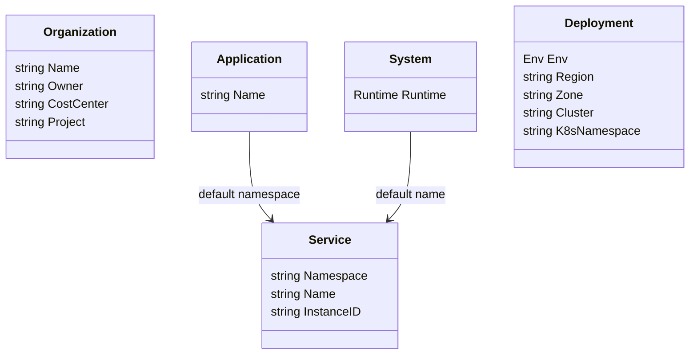
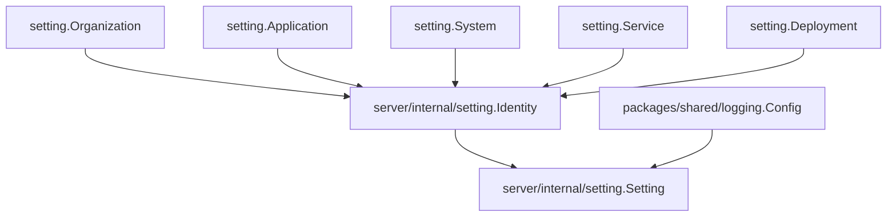

<!--
  dox
  Copyright (C) 2026  OpenDox

  This program is free software: you can redistribute it and/or modify
  it under the terms of the GNU General Public License as published by
  the Free Software Foundation, either version 3 of the License, or
  (at your option) any later version.

  This program is distributed in the hope that it will be useful,
  but WITHOUT ANY WARRANTY; without even the implied warranty of
  MERCHANTABILITY or FITNESS FOR A PARTICULAR PURPOSE. See the
  GNU General Public License for more details.

  You should have received a copy of the GNU General Public License
  along with this program. If not, see <http://www.gnu.org/licenses/>.

  @File    : docs/en-us/handbook/shared-packages/setting/model.md
  @Author  : Frost Leo <frostleo.dev@gmail.com>
  @Created : 2026-04-27
  @Modified: 2026-04-27
-->

# Chapter 2: Shared Setting Model

| Previous | Up | Next |
| --- | --- | --- |
| [Chapter 1: Contract](contract.md) | [Shared setting package](README.md) | [Chapter 3: Functions and API](functions.md) |

> [!NOTE]
> This chapter describes data shape. For method behavior and exported helpers, continue to [Chapter 3](functions.md).

## Model Map

The package exports independent fragments. It does not export a root aggregate tying them together.

## Runtime

`Runtime` identifies one Dox runtime system.

| Constant | Value | Meaning |
| --- | --- | --- |
| `RuntimeServer` | `server` | Web backend runtime. |
| `RuntimeScheduler` | `scheduler` | Scheduling runtime. |
| `RuntimeCollector` | `collector` | Collection runtime. |
| `RuntimeCompute` | `compute` | Computation runtime. |

Use `Runtime.IsValid()` to check whether a value is one of the supported Dox runtime names.

## Env

`Env` identifies a deployment environment.

| Constant | Value | Meaning |
| --- | --- | --- |
| `EnvDev` | `dev` | Development environment. |
| `EnvTest` | `test` | Test environment. |
| `EnvStaging` | `staging` | Staging environment. |
| `EnvProd` | `prod` | Production environment. |

Use `Env.IsValid()` to check whether a value is one of the supported Dox environment names.

## Organization

`Organization` describes shared ownership and governance identity.

| Field | Tags | Default | Validation | Intent |
| --- | --- | --- | --- | --- |
| `Name` | `json/yaml/mapstructure:"name"` | `opendox` when empty | `required,dox_identifier` | Organization identity. |
| `Owner` | `owner` | Empty | `omitempty,dox_identifier` | Owning team or owner code. |
| `CostCenter` | `cost_center` | Empty | `omitempty,dox_identifier` | Cost allocation code. |
| `Project` | `project` | Empty | `omitempty,dox_identifier` | Project identity. |

Keep these values stable and machine-friendly. Human display names belong in runtime or product metadata, not this fragment.

## Application

`Application` describes the product or application family identity.

| Field | Tags | Default | Validation | Intent |
| --- | --- | --- | --- | --- |
| `Name` | `json/yaml/mapstructure:"name"` | `dox` when empty | `required,dox_kebab` | Dox application family name. |

This value can seed `Service.Namespace` through `Service.Default`.

## System

`System` describes the Dox core system identity for a runtime.

| Field | Tags | Default | Validation | Intent |
| --- | --- | --- | --- | --- |
| `Runtime` | `json/yaml/mapstructure:"runtime"` | None | `required,dox_runtime` | Runtime system identity. |

`System.Default` intentionally does not set `Runtime`. Concrete runtime packages should set it when they own enough context.

## Service

`Service` describes one logical service identity.

| Field | Tags | Default | Validation | Intent |
| --- | --- | --- | --- | --- |
| `Namespace` | `json/yaml/mapstructure:"namespace"` | `Application.Name` when empty | `required,dox_kebab` | Service namespace. |
| `Name` | `json/yaml/mapstructure:"name"` | `string(System.Runtime)` when empty and runtime is known | `required,dox_kebab` | Logical service name. |
| `InstanceID` | `json/yaml/mapstructure:"instance_id"` | Empty | `omitempty,dox_identifier` | Specific process, pod, node, or deployment instance. |

Services may share `InstanceID` values when the caller intentionally models multiple logical services running in one process or pod.

## Deployment

`Deployment` describes where a runtime or service is deployed.

| Field | Tags | Default | Validation | Intent |
| --- | --- | --- | --- | --- |
| `Env` | `json/yaml/mapstructure:"env"` | `dev` when empty | `required,dox_env` | Deployment environment. |
| `Region` | `region` | Empty | `omitempty,dox_identifier` | Cloud or operational region. |
| `Zone` | `zone` | Empty | `omitempty,dox_identifier` | Availability zone or equivalent placement. |
| `Cluster` | `cluster` | Empty | `omitempty,dox_identifier` | Cluster identity. |
| `K8sNamespace` | `k8s_namespace` | Empty | `omitempty,dox_identifier` | Kubernetes namespace. |

`Deployment.Default` is intentionally limited to `EnvDev`. It does not invent region, zone, cluster, or namespace values.

## Validation Rule Details

| Rule | Accepts | Rejects |
| --- | --- | --- |
| `dox_kebab` | `dox`, `dox-server`, `iam-service` | `Dox`, `dox_iam`, `iam-service-` |
| `dox_identifier` | `opendox`, `us-east-1`, `server_pod.1` | `Platform Team`, `dox-prod-`, `_hidden` |
| `dox_runtime` | `server`, `scheduler`, `collector`, `compute` | `worker`, `queue`, `api` |
| `dox_env` | `dev`, `test`, `staging`, `prod` | `stage`, `production`, `local` |

> [!WARNING]
> The validation rules prefer stable identifiers over human-readable labels. Put display labels in another model if a user-facing name is required.

## Current Consumer Relationship

The current server setting package composes shared fragments like this:

This diagram is a consumer example. The shared package still exports only independent fragments.

## Navigation

| Previous | Up | Next |
| --- | --- | --- |
| [Chapter 1: Contract](contract.md) | [Shared setting package](README.md) | [Chapter 3: Functions and API](functions.md) |
