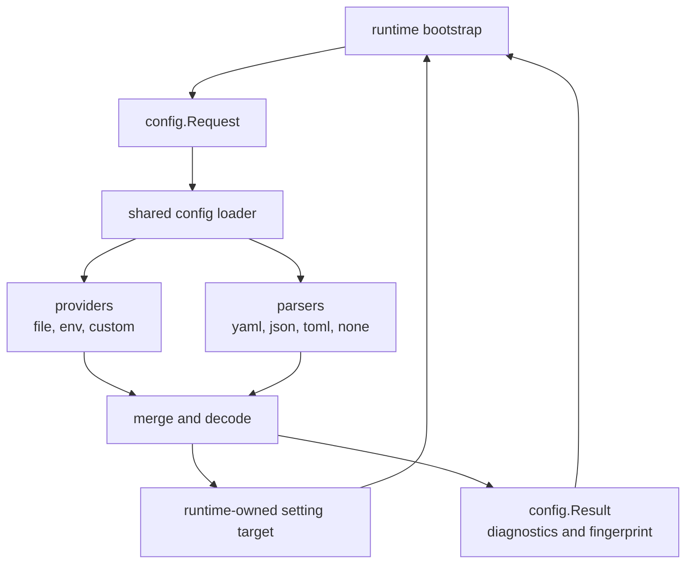

<!--
  dox
  Copyright (C) 2026  OpenDox

  This program is free software: you can redistribute it and/or modify
  it under the terms of the GNU General Public License as published by
  the Free Software Foundation, either version 3 of the License, or
  (at your option) any later version.

  This program is distributed in the hope that it will be useful,
  but WITHOUT ANY WARRANTY; without even the implied warranty of
  MERCHANTABILITY or FITNESS FOR A PARTICULAR PURPOSE. See the
  GNU General Public License for more details.

  You should have received a copy of the GNU General Public License
  along with this program. If not, see <http://www.gnu.org/licenses/>.

  @File    : docs/zh-cn/handbook/shared-packages/config/README.md
  @Author  : Frost Leo <frostleo.dev@gmail.com>
  @Created : 2026-04-27
  @Modified: 2026-04-27
-->

# Shared Config 包手册

`packages/shared/config` 是 Dox 共享的配置加载 SDK。它为各个后端 runtime 提供一套显式流程：读取声明的配置源、解析 payload、合并值、解码到调用方拥有的目标对象，并返回可观察诊断信息。

这份手册定义 runtime packages 和系统工程手册可引用的包级 config loading 契约。

> [!IMPORTANT]
> Runtime packages 可以引用这个包，但 runtime bootstrap 仍然负责 source list selection、default path discovery、secret resolution、redaction policy、hot reload lifecycle，以及 domain-specific setting validation。

## 手册页面

| 页面 | 包问题 |
| --- | --- |
| [契约](contract.md) | 哪些 request、source、option、result、diagnostic 和 error 语义对消费者稳定。 |
| [管线](pipeline.md) | Values 如何经过 provider、parser、merge、decode、fingerprint 和 diagnostics 阶段。 |
| [函数与 API](functions.md) | 可用的导出入口、接口、helper 和调用方责任。 |

## 包定位



这个包负责配置加载管线契约。它在工作开始前验证 API 使用方式，为一个显式 `Request` 执行加载流程，并返回调用方可以记录或检查的 `Result`。

## 当前能力矩阵

| 区域 | 当前状态 |
| --- | --- |
| 本地文件 provider | 已为 required 和 optional file sources 实现。 |
| 环境变量 provider | 已实现 prefix filtering 和 dotted-key expansion。 |
| YAML parser | 已为 object-rooted YAML payloads 实现。 |
| JSON parser | 已为 object-rooted JSON payloads 实现，并保留 JSON numbers。 |
| TOML parser | 已为 object-rooted TOML payloads 实现。 |
| `none` parser | 已为 structured provider values 实现，主要用于 env sources。 |
| Merge strategy | 已实现 map deep merge，scalar 和 slice 替换。 |
| Source ordering | 已按 `Priority` 升序实现；重复 priority 会被拒绝。 |
| Decode | 已通过 `mapstructure` 为 struct 和 map pointers 实现。 |
| Unknown key policy | 已实现默认 reject 行为。 |
| Result fingerprint | 已实现基于 merged structured values 的稳定 `sha256:`。 |
| Diagnostics | 已实现 source participation 和 override records。 |
| Custom pipeline components | 已通过 custom providers、parsers、mergers、decoders 实现。 |
| Remote provider reads | 默认 loader 未实现；`ProviderKindRemote` 只是命名 kind。 |
| 文件监听和热重载 | 本包不实现。 |
| 默认路径发现 | 本包不实现。 |
| Secret loading | 本包不实现。 |
| Schema generation | 本包不实现。 |
| Redaction | 已有 `Options.RedactKeys` 配置形状，但不会应用到 values、diagnostics、errors 或 fingerprints。 |

## 默认本地加载形状

```go
var target Setting
result, err := sharedconfig.Load(ctx, sharedconfig.Request{
	Runtime: "server",
	Env:     "dev",
	Target:  &target,
	Sources: []sharedconfig.Source{
		{
			Name:     "base",
			Kind:     sharedconfig.ProviderKindFile,
			Parser:   sharedconfig.ParserKindYAML,
			Location: "config/server.yaml",
			Required: true,
			Priority: 10,
		},
		{
			Name:     "env",
			Kind:     sharedconfig.ProviderKindEnv,
			Parser:   sharedconfig.ParserKindNone,
			Location: "DOX_SERVER_",
			Required: false,
			Priority: 100,
		},
	},
	Options: sharedconfig.Options{
		UnknownKeyPolicy: sharedconfig.UnknownKeyPolicyReject,
	},
})
```

这个形状先读取一个必需 YAML 文件，再用匹配前缀的环境变量作为更高优先级覆盖。调用方仍然负责 `Setting` 类型、默认值、领域校验和 runtime 启动行为。

> [!WARNING]
> `Options.RedactKeys` 目前只是 option 结构的一部分，当前管线不会执行 redaction。不要把返回 values、diagnostics、errors 或 fingerprints 当作已脱敏输出。

## 系统手册引用

系统工程手册应引用本包手册中的这些内容：

- source list 选择；
- bootstrap-derived values；
- runtime-specific defaults 和 validation；
- secret 和 redaction policy；
- hot reload 或 remote configuration lifecycle；
- startup logging 和 operational reporting。

Web、Scheduling、Collection、Computation 手册应单独记录自己的 concrete source lists、path defaults、secret stores、reload behavior 和 validation rules。

## 相关包手册

- [Shared setting 包](../setting/README.md)
- [Shared logging 包](../logging/README.md)
- Package source: `packages/shared/config`
- Current server consumer: `server/internal/bootstrap/config`
