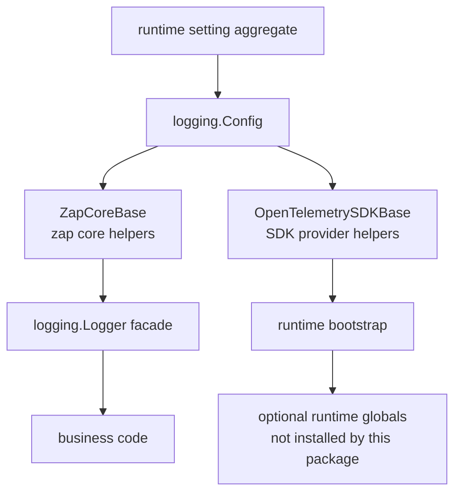

<!--
  dox
  Copyright (C) 2026  OpenDox

  This program is free software: you can redistribute it and/or modify
  it under the terms of the GNU General Public License as published by
  the Free Software Foundation, either version 3 of the License, or
  (at your option) any later version.

  This program is distributed in the hope that it will be useful,
  but WITHOUT ANY WARRANTY; without even the implied warranty of
  MERCHANTABILITY or FITNESS FOR A PARTICULAR PURPOSE. See the
  GNU General Public License for more details.

  You should have received a copy of the GNU General Public License
  along with this program. If not, see <http://www.gnu.org/licenses/>.

  @File    : docs/zh-cn/handbook/shared-packages/logging/README.md
  @Author  : Frost Leo <frostleo.dev@gmail.com>
  @Created : 2026-04-27
  @Modified: 2026-04-27
-->

# Shared Logging 包参考

`packages/shared/logging` 定义 Dox 共享 logging model、configuration contract、logger facade、zap core helpers 和 OpenTelemetry SDK helpers。

这份参考文档面向正式工程手册引用。它不是线性教程；每个页面都是自包含引用页，回答一种实现问题。

> [!IMPORTANT]
> Runtime packages 可以引用这个包，但 runtime bootstrap 仍然负责 logger construction、OpenTelemetry global installation、HTTP middleware wiring、scheduler/collector/compute integration，以及部署相关 output policy。

## Reference Map

| 页面 | 适合用来查询 |
| --- | --- |
| [契约](contract.md) | 包保证什么、不实现什么，以及 config validation/error semantics。 |
| [模型](model.md) | Resource、correlation、event、node、tags、fields 在 log records 中如何成形。 |
| [Runtime 边界](runtime-boundary.md) | Zap core base 和 OpenTelemetry SDK base 会构建什么，哪些 runtime responsibilities 仍在包外。 |
| [函数与 API](functions.md) | 调用方可用的 exported types、constructors、helpers 和 constants。 |

## 包定位



Business code 应依赖 `logging.Logger` 和 `logging.Attr`。Runtime bootstrap code 可以使用 `ZapCoreBase` 和 `OpenTelemetrySDKBase`。

## 当前能力矩阵

| 区域 | 当前状态 |
| --- | --- |
| Config shape | 已实现 defaults、JSON/YAML/mapstructure tags 和 validation。 |
| Logger facade | 已实现 Dox-owned `Logger` 和 `Attr` API，business-facing signatures 不暴露 zap types。 |
| Context correlation | 已实现 context storage、overlay merge 和 log-call merge behavior。 |
| Zap console core | 已实现。 |
| Zap JSON file core | 已实现。 |
| Lumberjack rotation | 已为 single-path file core 实现。 |
| OpenTelemetry resource | 已实现，并 merge 到 SDK defaults 之上。 |
| OpenTelemetry propagator | 已为 trace context 和 baggage 实现。 |
| OpenTelemetry SDK providers | traces、metrics、logs 开启时已实现 provider construction。 |
| OpenTelemetry global installation | 本包不实现。 |
| OTLP exporter setup | 不实现；SDK base 会拒绝开启的 OTLP exporter。 |
| Dataset routing | 已配置和验证，但尚未应用到 core routing。 |
| Buffering | 已配置和验证，但尚未安装 buffered writer。 |
| Redaction | 已配置和验证，但尚未执行 field/value redaction。 |
| Default file path template rendering | 未实现；template 当前会作为 literal output path 传入。 |

## 默认配置形状

默认配置会创建一个 console core 和一个 JSONL file core：

```yaml
level: info
cores:
  - name: console
    enabled: true
    type: console
    level: info
    encoding: console
    output_paths: ["stdout"]
    datasets: ["*"]
  - name: service-file
    enabled: true
    type: file
    level: info
    encoding: json
    output_paths: ["logs/${service.namespace}-${service.name}.jsonl"]
    datasets: ["*"]
    rotation:
      driver: lumberjack
      enabled: true
      max_size_mb: 100
      max_backups: 10
      max_age_days: 14
      compress: true
      local_time: true
```

> [!WARNING]
> `logs/${service.namespace}-${service.name}.jsonl` 当前只是字符串默认值，不是已渲染模板。真正获得动态 service-specific path 前，runtime bootstrap 或后续 package change 必须负责渲染。

## 正式文档引用方式

系统工程手册应该链接到这份参考，而不是复制包行为。适合引用的目标包括：

- `logging.Config` defaults 和 validation rules；
- resource/correlation/event fields 的 log record model；
- zap 和 OpenTelemetry runtime boundary；
- explicit unsupported behavior matrix。

Web、Scheduling、Collection、Computation 的手册应该单独记录自己的 bootstrap choices，例如 output paths、global provider installation、middleware correlation 和 deployment collectors。

## 相关参考

- [Shared config 包](../config/README.md)
- [Shared setting 包](../setting/README.md)
- Package source: `packages/shared/logging`
- Current server consumer: `server/internal/setting`
