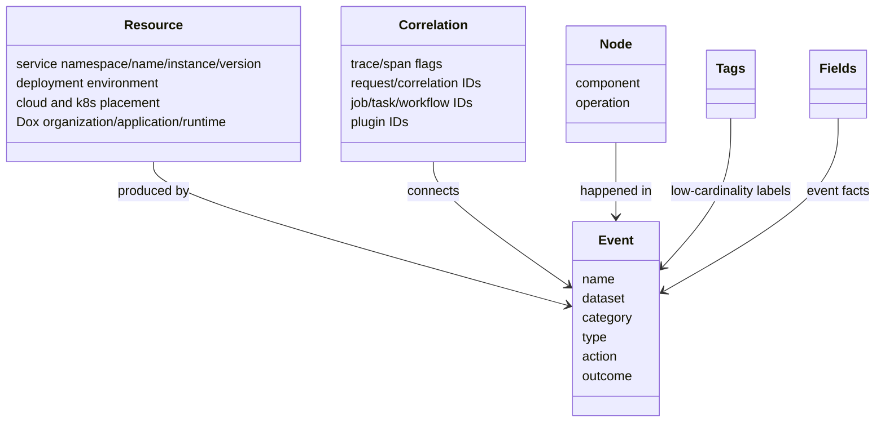

<!--
  dox
  Copyright (C) 2026  OpenDox

  This program is free software: you can redistribute it and/or modify
  it under the terms of the GNU General Public License as published by
  the Free Software Foundation, either version 3 of the License, or
  (at your option) any later version.

  This program is distributed in the hope that it will be useful,
  but WITHOUT ANY WARRANTY; without even the implied warranty of
  MERCHANTABILITY or FITNESS FOR A PARTICULAR PURPOSE. See the
  GNU General Public License for more details.

  You should have received a copy of the GNU General Public License
  along with this program. If not, see <http://www.gnu.org/licenses/>.

  @File    : docs/zh-cn/handbook/shared-packages/logging/model.md
  @Author  : Frost Leo <frostleo.dev@gmail.com>
  @Created : 2026-04-27
  @Modified: 2026-04-27
-->

# Shared Logging 模型

Shared logging 模型定义 Dox log records 如何描述 producer、execution chain、observed event、internal node、tags 和 detailed fields。

## 模型图



## Resource

Resource fields 回答谁产生了 telemetry。

| Field Constant | JSON Field | 含义 |
| --- | --- | --- |
| `FieldServiceNamespace` | `service.namespace` | Service namespace，通常是 `dox`。 |
| `FieldServiceName` | `service.name` | Service capability name，不一定等于 runtime。 |
| `FieldServiceInstanceID` | `service.instance.id` | Process、pod、node 或 instance identity。 |
| `FieldServiceVersion` | `service.version` | Deployed service version。 |
| `FieldDeploymentEnvironmentName` | `deployment.environment.name` | Deployment env，例如 `prod`。 |
| `FieldCloudRegion` | `cloud.region` | Cloud region。 |
| `FieldCloudAvailabilityZone` | `cloud.availability_zone` | Cloud availability zone。 |
| `FieldK8sClusterName` | `k8s.cluster.name` | Kubernetes cluster。 |
| `FieldK8sNamespaceName` | `k8s.namespace.name` | Kubernetes namespace。 |
| `FieldDoxOrganization` | `dox.organization` | Dox owner organization。 |
| `FieldDoxApplication` | `dox.application` | Dox application family。 |
| `FieldDoxRuntime` | `dox.runtime` | Dox runtime: `server`, `scheduler`, `collector`, `compute`。 |

> [!TIP]
> `service.name` 标识 service capability。`dox.runtime` 标识 runtime process family。一个 `server` runtime 可以承载 `iam` service。

## Correlation

Correlation fields 连接 request、job、task、workflow、plugin run 或 cross-runtime chain。

| Field Constant | JSON Field |
| --- | --- |
| `FieldTraceID` | `trace_id` |
| `FieldSpanID` | `span_id` |
| `FieldTraceFlags` | `trace_flags` |
| `FieldRequestID` | `request_id` |
| `FieldCorrelationID` | `correlation_id` |
| `FieldJobID` | `job_id` |
| `FieldTaskID` | `task_id` |
| `FieldWorkflowID` | `workflow_id` |
| `FieldPluginID` | `plugin_id` |
| `FieldPluginRunID` | `plugin_run_id` |

`trace_id`、`span_id`、`trace_flags` 与 OpenTelemetry 对齐。`correlation_id` 由 Dox 拥有，应跨 request、task、event、plugin boundaries 保留下来。

## Event

Event fields 描述 log record 观察到什么。

| Field Constant | JSON Field | 示例 |
| --- | --- | --- |
| `FieldEventName` | `event.name` | `iam.login.rejected` |
| `FieldEventDataset` | `event.dataset` | `dox.iam.security` |
| `FieldEventCategory` | `event.category` | `authentication` |
| `FieldEventType` | `event.type` | `denied` |
| `FieldEventAction` | `event.action` | `login` |
| `FieldEventOutcome` | `event.outcome` | `failure` |

这里没有 first-class `channel` field。Dataset、category、type、action 和 outcome 承担 event classification。

## Node

Node fields 描述 event 发生在 service 内部哪里。

| Field Constant | JSON Field | 含义 |
| --- | --- | --- |
| `FieldComponent` | `component` | Internal component，例如 `auth_service`。 |
| `FieldOperation` | `operation` | Operation，例如 `verify_credential`。 |

## Tags 和 Fields

`Tags` 是当前 node 声明的 low-cardinality business labels。`Fields` 是 event facts 和 higher-cardinality details。

| 使用 `tags` 表示 | 使用 `fields` 表示 |
| --- | --- |
| `risk_level` | `account` |
| `login_method` | `tenant_id` |
| `credential_type` | `client_ip` |
| `reject_reason` | `failed_attempts` |
| `queue` | raw IDs and measured facts |

不要把 resource fields、correlation IDs 或 verbose error text 放进 `tags`。

<details>
<summary>示例：IAM login rejected record</summary>

```json
{
  "service.namespace": "dox",
  "service.name": "iam",
  "dox.runtime": "server",
  "deployment.environment.name": "prod",
  "trace_id": "trace_001",
  "request_id": "req_001",
  "correlation_id": "corr_001",
  "event.name": "iam.login.rejected",
  "event.dataset": "dox.iam.security",
  "event.category": "authentication",
  "event.type": "denied",
  "event.action": "login",
  "event.outcome": "failure",
  "component": "auth_service",
  "operation": "verify_credential",
  "tags": {
    "risk_level": "medium",
    "login_method": "password",
    "reject_reason": "invalid_password"
  },
  "fields": {
    "account": "alice@example.com",
    "tenant_id": "tenant_a",
    "client_ip": "203.0.113.10"
  }
}
```

</details>

## Logger Attributes 的 Merge Semantics

Attribute constructors 会合并 non-empty structured values：

- `ResourceAttr`、`CorrelationAttr`、`EventAttr`、`NodeAttr` overlay non-empty fields。
- `TagsAttr` 和 `FieldsAttr` copy non-empty keys 的 entries。
- `FieldAttr` 向 `fields` 增加一个 entry。
- `ErrorAttr` attach error field。

Call-site attributes 会在 logger-level attributes 和 context correlation 之后应用。Call-site values 可以覆盖之前的 structured values。

## 相关页面

- [契约](contract.md)
- [Runtime 边界](runtime-boundary.md)
- [函数与 API](functions.md)
