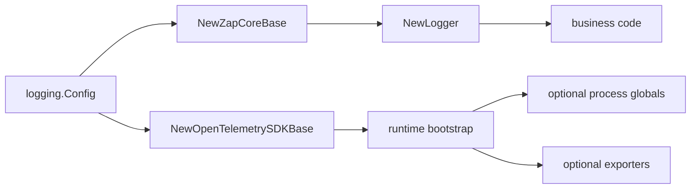

<!--
  dox
  Copyright (C) 2026  OpenDox

  This program is free software: you can redistribute it and/or modify
  it under the terms of the GNU General Public License as published by
  the Free Software Foundation, either version 3 of the License, or
  (at your option) any later version.

  This program is distributed in the hope that it will be useful,
  but WITHOUT ANY WARRANTY; without even the implied warranty of
  MERCHANTABILITY or FITNESS FOR A PARTICULAR PURPOSE. See the
  GNU General Public License for more details.

  You should have received a copy of the GNU General Public License
  along with this program. If not, see <http://www.gnu.org/licenses/>.

  @File    : docs/zh-cn/handbook/shared-packages/logging/runtime-boundary.md
  @Author  : Frost Leo <frostleo.dev@gmail.com>
  @Created : 2026-04-27
  @Modified: 2026-04-27
-->

# Shared Logging Runtime 边界

本页回答 `packages/shared/logging` 如何接触 zap、lumberjack 和 OpenTelemetry SDK，同时不接管 runtime bootstrap。

## Boundary Diagram

这个包构建可复用 primitives。Runtime 决定何时、何处安装或暴露这些 primitives。

## Zap Core Base

`NewZapCoreBase` 当前实现：

- Dox `Level` 到 `zapcore.Level` 的 mapping；
- zap `AtomicLevel` creation；
- symbolic encoder mapping；
- zap `Config` mapping；
- console core creation；
- JSON file core creation；
- single output path 的 lumberjack rotation；
- 通过 zap output paths 实现 no-rotation file core；
- development、caller、stacktrace、error output、initial fields 等 zap options；
- optional zap sampling；
- `DisableErrorVerbose` behavior，让 `error` 保持 basic string 并 suppress `errorVerbose`。

`ZapCoreBase.Close` 释放已打开 sinks。Runtime bootstrap 拥有 base 时，必须在 shutdown 时调用。

## File Core 边界

| Rotation Driver | 当前行为 |
| --- | --- |
| `lumberjack` | 支持 exactly one output path 的 file core。 |
| `none` | 通过 zap file output path behavior 支持。 |
| `external` | 合法 config value，但当前 zap file sink 会拒绝。 |
| `logrotate` | 合法 config value，但当前 zap file sink 会拒绝。 |

> [!CAUTION]
> Lumberjack 假设同一台机器上只有一个 process 写入配置的 file path。Deployment policy 必须避免多个 Dox processes 共享同一个 rotating file path。

## OpenTelemetry SDK Base

`NewOpenTelemetrySDKBase` 当前实现：

- Dox `Resource` 到 OpenTelemetry resource attributes 的 mapping；
- merge 到 `sdkresource.Default()` 之上；
- trace context 和 baggage propagator mapping；
- `always_on`、`always_off`、`traceidratio`、`parentbased_traceidratio` trace sampler mapping；
- optional tracer provider construction；
- optional meter provider construction；
- optional logger provider construction；
- 使用 `Shutdown.Timeout` 的 force flush 和 shutdown。

Root OpenTelemetry disabled 时，base 仍暴露 resource 和 no-op propagator，但不会构建 providers。

## OpenTelemetry 边界

SDK base 不调用：

- `otel.SetTracerProvider`;
- `otel.SetMeterProvider`;
- `otel.SetTextMapPropagator`;
- 任何 process-global log provider setter。

它也不创建 OTLP exporters。如果 `otel.exporter.otlp.enabled` 为 true，`NewOpenTelemetrySDKBase` 会为 `otel.exporter.otlp.enabled` 返回 validation error。

## Runtime Bootstrap 责任

Runtime bootstrap 拥有：

- 把 runtime setting 转换成 `logging.Config` 和 `logging.Resource`；
- 渲染任何 output path templates；
- 选择 file locations 和 deployment sink policy；
- 构建 `ZapCoreBase`；
- 构建 `Logger` facade；
- 构建 `OpenTelemetrySDKBase`；
- 可选地安装 OpenTelemetry globals；
- 配置 exporters 或 collectors；
- 向 HTTP、task、job、workflow、plugin contexts 注入 correlation；
- 在正确生命周期点调用 `Sync`、`ForceFlush`、`Shutdown`、`Close`。

## 必须保持可见的当前缺口

| Gap | 为什么重要 |
| --- | --- |
| Redaction is not applied | 除非调用方先 sanitize，否则敏感值仍可能进入日志。 |
| Buffering is not installed | `BufferingConfig` 目前不会创建 buffered writer。 |
| Dataset routing is not applied | 所有 enabled cores 按 level 接收 records；`event.dataset` 目前不会选择 cores。 |
| Default file path template is not rendered | 除非 runtime code 替换 placeholders，否则默认 path 是 literal string。 |
| OTLP exporter is unsupported | Runtime/exporter integration 必须单独实现。 |
| No runtime bootstrap is included | Server、scheduler、collector、compute 必须自己 wire lifecycle behavior。 |

## 相关参考

- [契约](contract.md)
- [模型](model.md)
- [函数与 API](functions.md)
