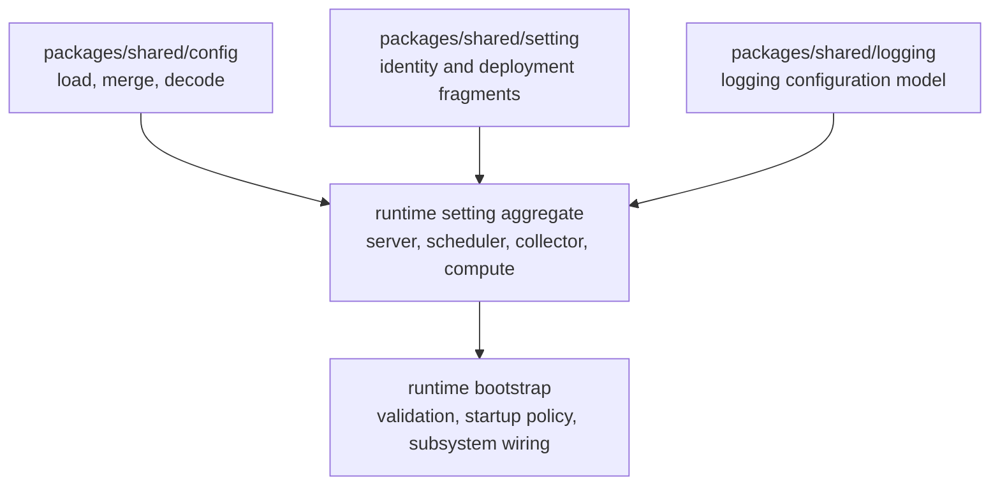

<!--
  dox
  Copyright (C) 2026  OpenDox

  This program is free software: you can redistribute it and/or modify
  it under the terms of the GNU General Public License as published by
  the Free Software Foundation, either version 3 of the License, or
  (at your option) any later version.

  This program is distributed in the hope that it will be useful,
  but WITHOUT ANY WARRANTY; without even the implied warranty of
  MERCHANTABILITY or FITNESS FOR A PARTICULAR PURPOSE. See the
  GNU General Public License for more details.

  You should have received a copy of the GNU General Public License
  along with this program. If not, see <http://www.gnu.org/licenses/>.

  @File    : docs/zh-cn/handbook/shared-packages/setting/README.md
  @Author  : Frost Leo <frostleo.dev@gmail.com>
  @Created : 2026-04-27
  @Modified: 2026-04-27
-->

# Shared Setting 包手册

`packages/shared/setting` 定义可复用的 Dox identity 和 deployment setting fragments。它刻意小于一个 runtime setting system：它只提供共享 fragment、默认值、enum 约束和 validation helpers，各 runtime 再把这些 fragment 组合进自己的 concrete aggregate。

这份手册定义 runtime packages 和系统工程手册可引用的包级 setting fragment 契约。

> [!IMPORTANT]
> Runtime packages 可以引用这个包，但 runtime bootstrap 仍然负责 concrete setting aggregates、runtime identity selection、runtime-specific defaults、cross-fragment validation，以及 subsystem-specific setting groups。

## 手册页面

| 页面 | 包问题 |
| --- | --- |
| [契约](contract.md) | 哪些行为属于 shared package，哪些行为属于 runtime package，以及 validation errors 应如何理解。 |
| [模型](model.md) | 哪些 fragments、enums、fields、defaults 和 validation tags 组成 shared setting model。 |
| [函数与 API](functions.md) | 哪些 exported constants、types、methods、helpers 和调用方责任构成 package API。 |

## 包定位



Shared setting package 被 runtime packages 消费，但它不知道正在构建哪个 concrete runtime。例如 `server/internal/setting` 会组合这些 fragments，并额外添加 server-owned 规则，例如强制 `System.Runtime` 为 `server`。

## 当前能力矩阵

| 区域 | 当前状态 |
| --- | --- |
| Runtime enum | 已实现 `server`、`scheduler`、`collector` 和 `compute`。 |
| Environment enum | 已实现 `dev`、`test`、`staging` 和 `prod`。 |
| Organization fragment | 已实现 default name 和 stable identifier validation。 |
| Application fragment | 已实现 default name 和 kebab-name validation。 |
| System fragment | 已实现 runtime validation，但不选择默认 runtime。 |
| Service fragment | 已实现 namespace/name default helpers 和 identifier validation。 |
| Deployment fragment | 已实现 default env 和 placement identifier fields。 |
| Fragment defaults | 已通过保守的 `Default` methods 实现。 |
| Fragment validation | 已通过 Dox-owned validation tags 实现。 |
| Validation errors | 已通过 Dox-owned `ValidationError` 和 `FieldError` 类型实现。 |
| Root `Setting` aggregate | 本包不实现。 |
| HTTP/database/security/queue/plugin settings | 本包不实现。 |
| Config source loading 和 decoding | 本包不实现。 |
| Service discovery 或 deployment manifest modeling | 本包不实现。 |
| Runtime bootstrap behavior | 本包不实现。 |
| Server-only validation rules | 本包不实现。 |

## 默认 Fragment 形状

```yaml
organization:
  name: opendox
application:
  name: dox
system:
  runtime: ""
service:
  namespace: dox
  name: ""
deployment:
  env: dev
```

`System.Default` 刻意不选择 runtime。只有 runtime value 已知时，`Service.Default` 才能从 `system.runtime` 填充 `service.name`。

> [!WARNING]
> 上面的空 `system.runtime` 和 `service.name` 不是合法的最终 runtime setting。Runtime packages 必须在 validation 之前选择自己的 runtime identity。

## 系统手册引用

系统工程手册应引用本包手册中的这些内容：

- 支持的 `Runtime` 和 `Env` 值；
- shared identity 和 deployment fragment 语义；
- defaulting 和 validation 契约；
- `ValidationError` 和 `FieldError` 形状；
- shared fragments 与 runtime-owned aggregates 的包边界。

Runtime 手册应单独记录自己的 aggregate shape、runtime selection、bootstrap-derived seed values、更严格 validation rules，以及 subsystem-specific setting groups。

## 相关包手册

- [Shared config 包](../config/README.md)
- [Shared logging 包](../logging/README.md)
- Package source: `packages/shared/setting`
- Current server consumer: `server/internal/setting`
