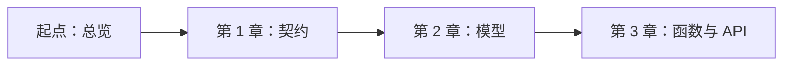
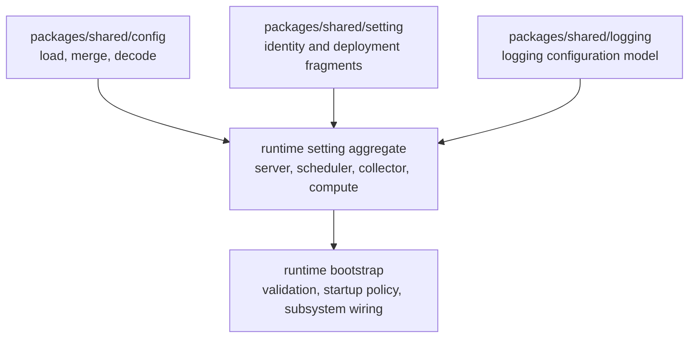

<!--
  dox
  Copyright (C) 2026  OpenDox

  This program is free software: you can redistribute it and/or modify
  it under the terms of the GNU General Public License as published by
  the Free Software Foundation, either version 3 of the License, or
  (at your option) any later version.

  This program is distributed in the hope that it will be useful,
  but WITHOUT ANY WARRANTY; without even the implied warranty of
  MERCHANTABILITY or FITNESS FOR A PARTICULAR PURPOSE. See the
  GNU General Public License for more details.

  You should have received a copy of the GNU General Public License
  along with this program. If not, see <http://www.gnu.org/licenses/>.

  @File    : docs/zh-cn/handbook/shared-packages/setting/README.md
  @Author  : Frost Leo <frostleo.dev@gmail.com>
  @Created : 2026-04-27
  @Modified: 2026-04-27
-->

# Shared Setting 包手册

| 上一章 | 上级 | 下一章 |
| --- | --- | --- |
| [Shared config 包](../config/README.md) | Shared packages | [第 1 章：契约](contract.md) |

> [!NOTE]
> 这份手册按一个短模块书来写。新增 runtime setting aggregate 时请按顺序阅读；回查具体契约或 API 时使用章节链接。

`packages/shared/setting` 定义可复用的 Dox identity 和 deployment setting fragments。它刻意小于一个 runtime setting system：它只提供共享 fragment、默认值、enum 约束和 validation helpers，各 runtime 再把这些 fragment 组合进自己的 concrete aggregate。

## 阅读路径



1. [第 1 章：契约](contract.md) 定义包负责什么、不负责什么，以及如何理解 validation errors。
2. [第 2 章：模型](model.md) 描述每个 shared fragment、字段、默认值和 validation tags。
3. [第 3 章：函数与 API](functions.md) 列出导出类型、方法、常量和调用方责任。

## 本书范围

这份手册是以下内容的包级参考：

- Dox runtime identity values；
- Dox deployment environment values；
- `Organization`、`Application`、`System`、`Service` 等 shared identity fragments；
- `Deployment` 等 shared deployment fragments；
- Dox-owned validation tags 和 validation error shape；
- shared fragments 与 runtime-owned setting aggregates 的复用边界。

未来 Web、Scheduling、Collection、Computation 的工程手册都可以链接这里。

## 包定位

`packages/shared/setting` 位于通用 config loading 和 runtime-specific setting aggregates 之间。



Shared setting package 被 runtime packages 消费，但它不知道正在构建哪个 concrete runtime。例如 `server/internal/setting` 会组合这些 fragments，并额外添加 server-owned 规则，例如强制 `System.Runtime` 为 `server`。

## 当前能力

这个包当前提供：

- `server`、`scheduler`、`collector`、`compute` 的 `Runtime` enum values；
- `dev`、`test`、`staging`、`prod` 的 `Env` enum values；
- 默认 organization 和 application 名称；
- `Organization`、`Application`、`System`、`Service`、`Deployment` fragments；
- 保守的 fragment `Default` methods；
- Dox-owned validation rules，用于 kebab names、stable identifiers、runtime values 和 env values；
- `ValidationError` 和 `FieldError` 类型，避免调用方依赖第三方 validator error 类型。

## 当前非能力

这个包当前不提供：

- root `Setting` aggregate；
- HTTP、database、security、queue、logging 或 plugin setting groups；
- config file loading、source merging 或 decoding；
- service discovery 或 deployment manifest modeling；
- 所有系统的默认 runtime selection；
- server-only validation rules；
- runtime bootstrap behavior。

> [!IMPORTANT]
> 不要因为某个 runtime 当前需要某条策略，就把 runtime-owned policy 移到这个包里。Shared fragments 必须继续可被 Web、Scheduling、Collection、Computation 复用。

## Consumer 集成清单

- [ ] 只组合语义匹配 runtime aggregate 的 fragments。
- [ ] 在能让流程更清晰时，先填 shared defaults，再填 runtime-specific defaults。
- [ ] Runtime-owned identity rules 留在 runtime package。
- [ ] 用 fragment 自己的 `Validate` methods 或 `setting.Validate` 校验 shared fragments。
- [ ] 在 aggregate 边界把 shared validation errors 和 runtime-owned validation errors 合并。
- [ ] Runtime-specific default 或更严格的 validation rule 应记录在 shared package handbook 之外。

<details>
<summary>示例：当前 server composition</summary>

`server/internal/setting.Identity` 组合了这些 shared fragments：

```go
type Identity struct {
	Organization sharedsetting.Organization `json:"organization" yaml:"organization" mapstructure:"organization"`
	Application  sharedsetting.Application  `json:"application" yaml:"application" mapstructure:"application"`
	System       sharedsetting.System       `json:"system" yaml:"system" mapstructure:"system"`
	Service      sharedsetting.Service      `json:"service" yaml:"service" mapstructure:"service"`
	Deployment   sharedsetting.Deployment   `json:"deployment" yaml:"deployment" mapstructure:"deployment"`
}
```

Server package 随后自己拥有 `System.Runtime` 必须为 `server` 的 server-specific rule。这条规则不是 shared package contract。

</details>

## 导航

| 上一章 | 上级 | 下一章 |
| --- | --- | --- |
| [Shared config 包](../config/README.md) | Shared packages | [第 1 章：契约](contract.md) |
