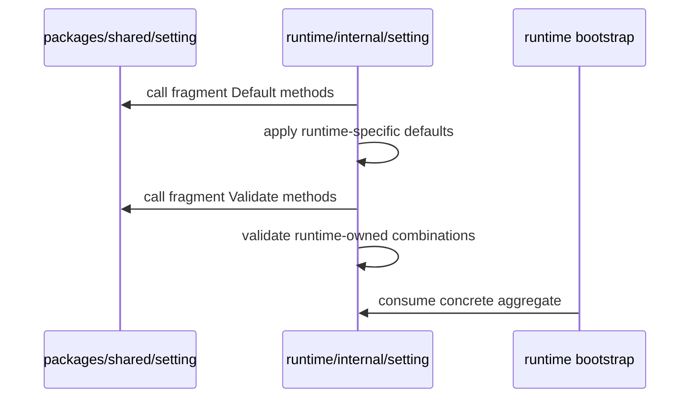

<!--
  dox
  Copyright (C) 2026  OpenDox

  This program is free software: you can redistribute it and/or modify
  it under the terms of the GNU General Public License as published by
  the Free Software Foundation, either version 3 of the License, or
  (at your option) any later version.

  This program is distributed in the hope that it will be useful,
  but WITHOUT ANY WARRANTY; without even the implied warranty of
  MERCHANTABILITY or FITNESS FOR A PARTICULAR PURPOSE. See the
  GNU General Public License for more details.

  You should have received a copy of the GNU General Public License
  along with this program. If not, see <http://www.gnu.org/licenses/>.

  @File    : docs/zh-cn/handbook/shared-packages/setting/contract.md
  @Author  : Frost Leo <frostleo.dev@gmail.com>
  @Created : 2026-04-27
  @Modified: 2026-04-27
-->

# 第 1 章：Shared Setting 契约

| 上一章 | 上级 | 下一章 |
| --- | --- | --- |
| [总览](README.md) | [Shared setting 包](README.md) | [第 2 章：模型](model.md) |

> [!TIP]
> 把这个包组合进 runtime aggregate 之前，先读本章。它定义哪些决策属于 shared package，哪些决策必须留在 runtime-owned code。

## 契约摘要

`packages/shared/setting` 负责可复用的 identity 和 deployment fragments。它不负责 concrete runtime setting aggregate。

| 契约区域 | 包责任 | 调用方责任 |
| --- | --- | --- |
| Runtime values | 声明支持的 Dox runtime enum values。 | 决定 concrete aggregate 接受哪个 runtime value。 |
| Environment values | 声明支持的 Dox deployment env values。 | 决定 env 如何由 bootstrap 或 deployment inputs 注入。 |
| Fragment defaults | 填充保守的 shared defaults。 | 在 shared defaults 之后或周围添加 runtime-specific defaults。 |
| Fragment validation | 校验 shared field syntax 和 enum values。 | 校验 runtime-specific combinations 和更严格规则。 |
| Error shape | 返回 Dox-owned validation error types。 | 在 runtime aggregate 边界合并或转换 errors。 |

## Identity 契约

这个包定义 identity fragments，而不是 global identity aggregate。Runtime 可以在语义匹配时把这些 fragments 组合进自己的 group：

- `Organization` 表示 ownership 和 governance identity；
- `Application` 表示 Dox application family；
- `System` 表示 Dox runtime identity；
- `Service` 表示一个 logical service identity；
- `Deployment` 表示 environment 和 deployment location。

Shared package 不决定 server 必须使用 `RuntimeServer`、scheduler 必须使用 `RuntimeScheduler`，也不决定 deployment env 来自哪个 flag。Runtime packages 拥有这些决策。

## Default 契约

默认值刻意保守。

| Fragment | Shared Default 行为 |
| --- | --- |
| `Organization` | 空 `Name` 变为 `opendox`。 |
| `Application` | 空 `Name` 变为 `dox`。 |
| `System` | 不自动发明 runtime。Runtime identity 必须显式提供，或由 consumer package 设置。 |
| `Service` | 空 `Namespace` 变为 `Application.Name`；只有 runtime 已知时，空 `Name` 才变为 `string(System.Runtime)`。 |
| `Deployment` | 空 `Env` 变为 `dev`。 |

> [!IMPORTANT]
> `System.Default` 按设计是 no-op。Shared package 无法安全地在 `server`、`scheduler`、`collector`、`compute` 之间替调用方做选择。

## Validation 契约

Validation 在 `go-playground/validator` 之上注册 Dox-owned tags。

| Tag | 含义 | 当前规则 |
| --- | --- | --- |
| `dox_kebab` | 稳定 kebab-case 名称。 | 必须以小写字母开头，可包含小写字母、数字和单连字符分隔段。 |
| `dox_identifier` | 稳定 infrastructure 或 governance identifier。 | 必须以小写字母或数字开头和结尾；中间可包含小写字母、数字、点、下划线和连字符。 |
| `dox_runtime` | 支持的 Dox runtime。 | 必须是 `server`、`scheduler`、`collector` 或 `compute`。 |
| `dox_env` | 支持的 Dox deployment environment。 | 必须是 `dev`、`test`、`staging` 或 `prod`。 |

Validator 暴露字段名时，优先使用 `mapstructure` tag，然后是 `json` tag，最后是 Go field name。

## Error 契约

包暴露：

- `FieldError`，包含 `Field` 和 `Rule`；
- `ValidationError`，包含 `Fields []FieldError`；
- `Validate(value any) error`，返回 nil 或 `ValidationError`。

调用方应把 `ValidationError.Fields` 当作机器可读契约。Error string 适合日志，但需要字段级处理时不应该解析字符串。

<details>
<summary>示例：validation field shape</summary>

非法 system runtime 会产生类似这样的 field entry：

```text
Field: System.runtime
Rule: dox_runtime
```

`runtime` 字段名来自 `mapstructure:"runtime"` tag。

</details>

## Runtime 边界

Runtime packages 组合 shared fragments，然后添加 runtime policy。



当前 server 行为只是 consumer 示例：

- server 组合 shared identity fragments；
- server 把缺失的 `System.Runtime` 默认成 `server`；
- server 拒绝合法但不是 server 的 runtime value；
- server 可以从 bootstrap options 注入 `Deployment.Env`。

这些规则记录为 server behavior，而不是 shared package behavior。

## 契约之外

以下内容不属于 shared setting contract：

- root runtime `Setting` structs；
- config source loading 或 decoding；
- logging configuration；
- HTTP、database、queue、plugin 或 security setting groups；
- service registry 或 deployment manifest schemas；
- runtime bootstrap、lifecycle 或 subsystem wiring；
- 为所有 consumers 选择 runtime identity；
- 从环境变量创建 process-wide defaults。

## 导航

| 上一章 | 上级 | 下一章 |
| --- | --- | --- |
| [总览](README.md) | [Shared setting 包](README.md) | [第 2 章：模型](model.md) |
