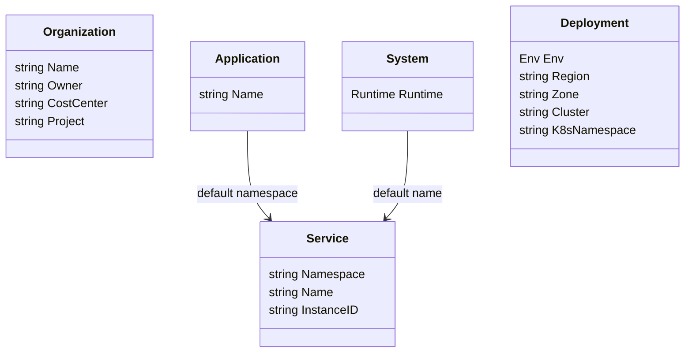
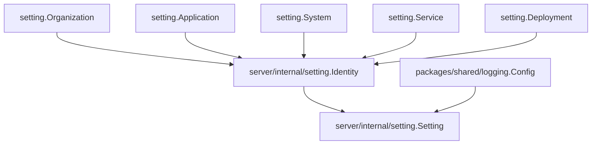

<!--
  dox
  Copyright (C) 2026  OpenDox

  This program is free software: you can redistribute it and/or modify
  it under the terms of the GNU General Public License as published by
  the Free Software Foundation, either version 3 of the License, or
  (at your option) any later version.

  This program is distributed in the hope that it will be useful,
  but WITHOUT ANY WARRANTY; without even the implied warranty of
  MERCHANTABILITY or FITNESS FOR A PARTICULAR PURPOSE. See the
  GNU General Public License for more details.

  You should have received a copy of the GNU General Public License
  along with this program. If not, see <http://www.gnu.org/licenses/>.

  @File    : docs/zh-cn/handbook/shared-packages/setting/model.md
  @Author  : Frost Leo <frostleo.dev@gmail.com>
  @Created : 2026-04-27
  @Modified: 2026-04-27
-->

# Shared Setting 模型

Shared setting 模型描述 `packages/shared/setting` 导出的 fragments、enum values、defaults、validation tags 和 consumer relationship。方法行为和导出 helpers 见 [函数与 API](functions.md)。

## 模型图

包导出的是独立 fragments。它不导出把这些 fragments 绑定在一起的 root aggregate。

## Runtime

`Runtime` 标识一个 Dox runtime system。

| Constant | Value | 含义 |
| --- | --- | --- |
| `RuntimeServer` | `server` | Web backend runtime。 |
| `RuntimeScheduler` | `scheduler` | Scheduling runtime。 |
| `RuntimeCollector` | `collector` | Collection runtime。 |
| `RuntimeCompute` | `compute` | Computation runtime。 |

使用 `Runtime.IsValid()` 检查某个值是否是支持的 Dox runtime name。

## Env

`Env` 标识 deployment environment。

| Constant | Value | 含义 |
| --- | --- | --- |
| `EnvDev` | `dev` | Development environment。 |
| `EnvTest` | `test` | Test environment。 |
| `EnvStaging` | `staging` | Staging environment。 |
| `EnvProd` | `prod` | Production environment。 |

使用 `Env.IsValid()` 检查某个值是否是支持的 Dox environment name。

## Organization

`Organization` 描述 shared ownership 和 governance identity。

| Field | Tags | Default | Validation | 意图 |
| --- | --- | --- | --- | --- |
| `Name` | `json/yaml/mapstructure:"name"` | 空值时为 `opendox` | `required,dox_identifier` | Organization identity。 |
| `Owner` | `owner` | 空 | `omitempty,dox_identifier` | Owning team 或 owner code。 |
| `CostCenter` | `cost_center` | 空 | `omitempty,dox_identifier` | Cost allocation code。 |
| `Project` | `project` | 空 | `omitempty,dox_identifier` | Project identity。 |

这些值应该稳定并对机器友好。人类展示名称属于 runtime 或 product metadata，不属于这个 fragment。

## Application

`Application` 描述 product 或 application family identity。

| Field | Tags | Default | Validation | 意图 |
| --- | --- | --- | --- | --- |
| `Name` | `json/yaml/mapstructure:"name"` | 空值时为 `dox` | `required,dox_kebab` | Dox application family name。 |

这个值可以通过 `Service.Default` 注入 `Service.Namespace`。

## System

`System` 描述 runtime 的 Dox core system identity。

| Field | Tags | Default | Validation | 意图 |
| --- | --- | --- | --- | --- |
| `Runtime` | `json/yaml/mapstructure:"runtime"` | 无 | `required,dox_runtime` | Runtime system identity。 |

`System.Default` 刻意不设置 `Runtime`。Concrete runtime packages 应在自己拥有足够上下文时设置它。

## Service

`Service` 描述一个 logical service identity。

| Field | Tags | Default | Validation | 意图 |
| --- | --- | --- | --- | --- |
| `Namespace` | `json/yaml/mapstructure:"namespace"` | 空值时为 `Application.Name` | `required,dox_kebab` | Service namespace。 |
| `Name` | `json/yaml/mapstructure:"name"` | 空值且 runtime 已知时为 `string(System.Runtime)` | `required,dox_kebab` | Logical service name。 |
| `InstanceID` | `json/yaml/mapstructure:"instance_id"` | 空 | `omitempty,dox_identifier` | 具体 process、pod、node 或 deployment instance。 |

当调用方明确建模多个 logical services 运行在同一个 process 或 pod 中时，services 可以共享 `InstanceID`。

## Deployment

`Deployment` 描述 runtime 或 service 部署在哪里。

| Field | Tags | Default | Validation | 意图 |
| --- | --- | --- | --- | --- |
| `Env` | `json/yaml/mapstructure:"env"` | 空值时为 `dev` | `required,dox_env` | Deployment environment。 |
| `Region` | `region` | 空 | `omitempty,dox_identifier` | Cloud 或 operational region。 |
| `Zone` | `zone` | 空 | `omitempty,dox_identifier` | Availability zone 或等价 placement。 |
| `Cluster` | `cluster` | 空 | `omitempty,dox_identifier` | Cluster identity。 |
| `K8sNamespace` | `k8s_namespace` | 空 | `omitempty,dox_identifier` | Kubernetes namespace。 |

`Deployment.Default` 只设置 `EnvDev`。它不会发明 region、zone、cluster 或 namespace。

## Validation Rule 细节

| Rule | 接受 | 拒绝 |
| --- | --- | --- |
| `dox_kebab` | `dox`, `dox-server`, `iam-service` | `Dox`, `dox_iam`, `iam-service-` |
| `dox_identifier` | `opendox`, `us-east-1`, `server_pod.1` | `Platform Team`, `dox-prod-`, `_hidden` |
| `dox_runtime` | `server`, `scheduler`, `collector`, `compute` | `worker`, `queue`, `api` |
| `dox_env` | `dev`, `test`, `staging`, `prod` | `stage`, `production`, `local` |

> [!WARNING]
> Validation rules 更偏向稳定 identifier，而不是人类可读 label。如果需要面向用户的名称，应放在另一个 model 中。

## 当前 Consumer 关系

当前 server setting package 这样组合 shared fragments：

这个图只是 consumer 示例。Shared package 仍然只导出独立 fragments。

## 相关页面

- [Shared setting 包手册](README.md)
- [Shared setting 契约](contract.md)
- [Shared setting 函数与 API](functions.md)
